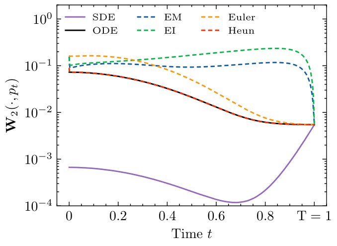
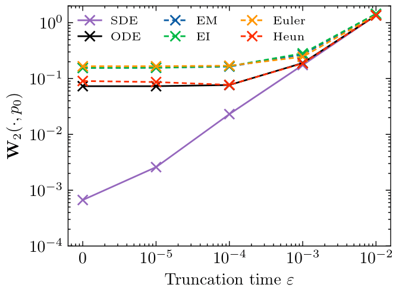
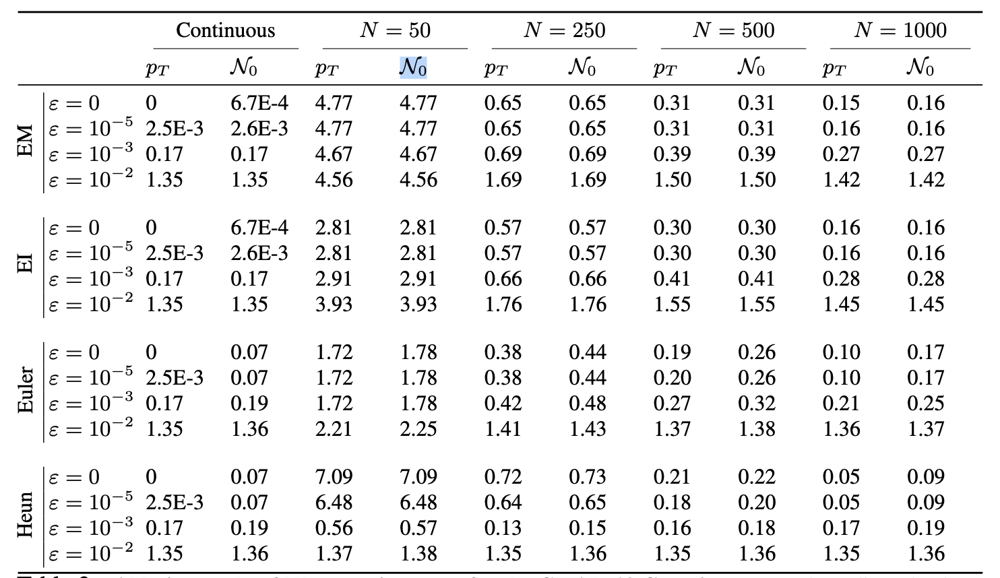

## Diffusion models for Gaussian distributions: Exact solutions and Wasserstein errors.

The following code provides figures and table of the preprint  [Emile Pierret,Bruno Galerne (2024). Diffusion models for Gaussian distributions: Exact solutions and Wasserstein errors. arXiv preprint arXiv:2405.14250.](https://arxiv.org/abs/2405.14250). You can use it with your own scheme and data.

The code reproduces Figure 1 with the following graphs

 

and gives also the tex source to generate Table 2 of the article which is:



## Usage

1. You can open the notebook using Google Colab:  [](https://colab.research.google.com/github/emilePi/Diffusion-models-for-Gaussian-distributions-Exact-solutions-and-Wasserstein-errors/blob/main/code/Gaussian_diffusion_W2.ipynb) or download it from the folder code. Data used in the paper is available in the folder *code*.

2. Download the data in your work directory from the folder [data](https://github.com/emilePi/Diffusion-models-for-Gaussian-distributions-Exact-solutions-and-Wasserstein-errors/tree/main/data)


## Reference
This peprint can be cited with the bibtex:
```bib
@INPROCEEDINGS{Pierret_Galerne_Gaussian_diffusion_Wasserstein_preprint,
  author={Pierret, Emile and Galerne, Bruno},
  year={2024},
  booktitle={Preprint}, 
  title={Diffusion models for Gaussian distributions: Exact solutions and Wasserstein errors}, 
}
```


